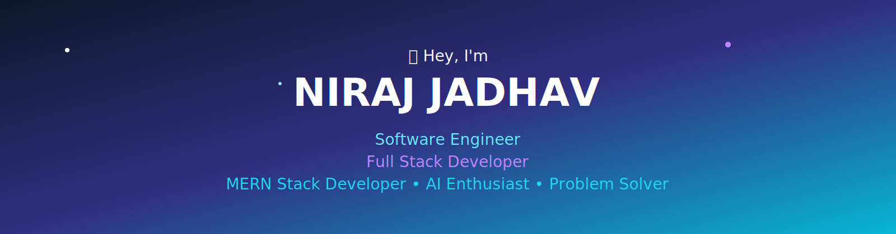
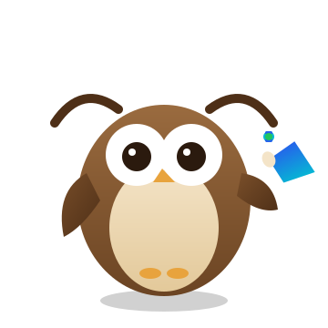

  

  

 
<table width="100%">
<tr>
<td width="70%" valign="middle">

</td>
<td width="50%" align="center" valign="middle">

</td>
</tr>
</table>

 

 

# 👨‍💻 About Me

<table width="100%">
<tr>

<td width="55%" valign="top">

### Hello! 👋

I'm **Niraj Jadhav**, a final-year **Electronics Engineering** student and **Full Stack Developer** who loves turning ideas into scalable, AI-powered web applications.

I build primarily with the **MERN Stack**, sharpen my fundamentals through **Data Structures & Algorithms**, and enjoy integrating **Generative AI** (Gemini API) into real products.

Beyond coding, I'm exploring **AWS**, **Docker**, and **Machine Learning** to build more scalable, cloud-ready systems.

### What I Do

- Build Full Stack MERN Applications
- Integrate AI (Gemini API) into real-world products
- Design Clean & Responsive User Interfaces
- Develop secure REST APIs with JWT Authentication
- Solve Data Structures & Algorithms problems
- Explore Cloud (AWS) & Containerization (Docker)

</td>

<td width="45%" valign="top">

| **Professional Information** | |
|:-----------------------------|:----------------|
| 🎓 Education | B.Tech Electronics, Final Year |
| 💻 Role | Full Stack Developer |
| 🚀 Stack | MERN Stack + AI |
| 🧠 Interest | DSA, AI & Problem Solving |
| 📚 Currently Learning | AWS, Docker & Machine Learning |
| 🌍 Looking For | Software Engineering Opportunities |
| ⚡ Status | Open to Opportunities |

</td>

</tr>
</table>

 

 

# 🎓 Education

| Qualification | Institute | Score |
|:---|:---|:---:|
| B.Tech (Electronics) | Walchand College of Engineering, Sangli | CGPA: 7.69/10 |
| HSC (12th) | Y. C. College, Satara | 82.50% |
| SSC (10th) | Gurukul School, Satara | 94.60% |

 

# 🛠️ Tech Stack

## Technologies I work with every day.

 

<!-- Animated scrolling tech marquee -->

 

<table align="center" width="100%">

<tr>

<td align="center" width="50%">

## 💻 Languages

 

</td>

<td align="center" width="50%">

## 🎨 Frontend

 

</td>

</tr>

<tr>

<td align="center">

## ⚙️ Backend

 

</td>

<td align="center">

## 🗄️ Database

 

</td>

</tr>

<tr>

<td colspan="2" align="center">

## ☁️ Cloud, AI & Tools

 

  

</td>

</tr>

</table>

 

| 🚀 Development Focus |
|:--------------------:|
| Full Stack MERN Development • AI Integration • REST APIs • Responsive UI • Authentication • Docker • Cloud (AWS) • Clean Code |

 

# 🚀 Featured Projects

A collection of projects showcasing my expertise in Full Stack Development, AI integration, and modern web technologies.

 

<table width="100%">

<tr>

<td width="50%" valign="top">

## 🤖 QuickHireAI – Smart Interview Platform

AI-powered mock interview platform built with the MERN stack and **Gemini API**. Features JWT authentication, interview scheduling, AI-generated questions, speech recognition, and AI-based evaluation.

 

  

</td>

<td width="50%" valign="top">

## 🛍️ MyEthnicShop – E-Commerce for Ethnic Wear

Full-stack MERN e-commerce app for a boutique selling sarees, kurtis, and dresses — with cart, checkout, admin product management, payment gateway integration, PDF invoices, and sales analytics.

 

  

</td>

</tr>

<tr>

<td colspan="2">

## 📧 MailGen AI – AI Cold Email Generator

An AI-powered cold email generator built using the MERN stack and Google's **Gemini AI**. Helps job seekers, freelancers, and sales professionals generate personalized outreach emails, LinkedIn messages, and follow-up emails in seconds. Includes secure authentication, OTP-based email verification, campaign history management, Docker support, and a modern responsive interface.

 

  

</td>

</tr>

</table>

 

# 🌱 Currently Learning

### Always learning, always improving.

 

 

# 🏆 Achievements & Certifications

<table>
<tr>
<td valign="top" width="50%">

**Achievements**
- 🏅 Cummins India Scholar — Top 800 students nationwide
- 🎖️ UPSC NDA SSB Recommended (2022)
- 💻 300+ DSA problems solved

</td>
<td valign="top" width="50%">

**Certifications**
- AWS Cloud Practitioner – Compute, Networking & Account Strategies
- Fundamentals of Generative AI
- IBM SQL
- Gemini Certified Student
- NVIDIA – Fundamentals of Deep Learning

</td>
</tr>
</table>

 

<!-- Animated GitHub Trophy showcase -->

 

# 💭 Developer Philosophy

> ### *"Clean code always beats clever code."*
>
> ### *"I enjoy solving real-world problems through scalable, AI-powered software."*
>
> ### *"Consistency compounds into expertise."*

 

# 📊 GitHub Statistics

### My GitHub at a Glance

 

  

  

 

---
### Contribution Graph

 

 

---
### 🧊 3D Contribution Calendar

Generated automatically via the <code>yoshi389111/github-profile-3d-contrib</code> GitHub Action — set up separately in a workflow, output committed to <code>profile-3d-contrib/profile-night-green.svg</code>.

  

 

# 🐍 Contribution Snake

### Watch my contributions come alive

 

 

The snake animation is generated automatically via a GitHub Actions workflow (set up separately — see note below).

 

# 📫 Let's Connect

 

# 💼 What You'll Find Here

| 🚀 |
|:---:|
| Full Stack MERN Projects |
| AI-powered Applications |
| REST APIs |
| Authentication Systems |
| Modern React Applications |
| Dockerized Projects |
| Problem Solving & DSA |

 

# 📌 Current Focus

 

---

## ⭐ Thanks for Visiting!!

If you enjoyed exploring my projects,

consider giving them a ⭐ on GitHub.

Your support motivates me to build more amazing software.

  

  

